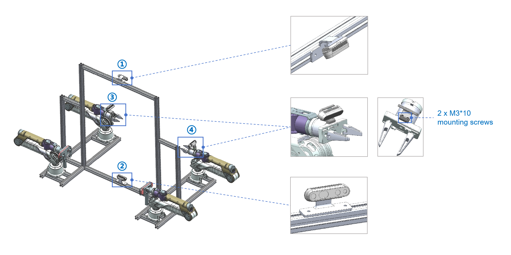

# Tabletop Teleoperation STP
The `STP files` of this repository describes the physical structure of Tabletop Teleoperation.

The correspondence between the labels in the image above and the STP file is as follows:

| label | STP file                           |
|-------|------------------------------------|
| 1     | 1_L515_Top_mounting_bracket.stp    |
| 2     | 2_L515_Bottom_mounting_bracket.stp |
| 3     | 3_D435i_mounting_bracket.stp       |
| 4     | 4_D435i_mounting_bracket.stp       |